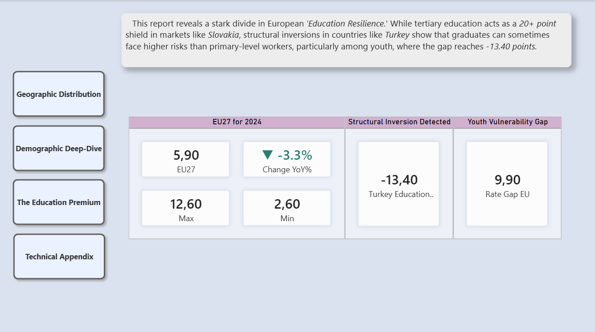

# EU Unemployment Dynamics (2014-2024): A multi-dimensional analysis of labor market resilience. 

> **Project Overview:** *This Power BI project analyzes labor market dynamics across 30+ European countries, uncovering a stark "Education Shield" in Western Europe and structural inversions in candidate states such as Turkey.*
> 
> **The Vision:** This project was designed to transform raw, complex Eurostat labour data into an interactive decision-support tool. The goal was to move beyond static reporting and explore the intersection of geography, education, and demographics to identify which factors most heavily influence employment resilience across Europe.
> 
> **Important Moments:** Education as a Shield - By developing dynamic "Risk Reduction" measures, the dashboard quantifies that tertiary education reduces unemployment risk by an average of *68%* across the EU.  
> **Geospatial Trends:** The map doesn't just show color; it uses Context-Aware Tooltips to reveal how a specific region’s 10-year recovery path differs from its parent nation. 
Predictive Motion: The animated Scatter Plot reveals the "lag" in economic recovery, showing how different countries move through the quadrants of educational employment over a decade.  
> **The Problems:** Working with Eurostat data presents a unique "Grain" challenge: datasets often mix National, NUTS1, and NUTS2 levels into a single column. I solved this by architecting a Multi-Level Star Schema, allowing the user to seamlessly transition from a high-level European overview to a specific regional trend without data duplication or calculation errors.  
> **Tools & Technologies:**  
Power BI: UI/UX Design & Data Visualization.  
Power Query (M): Data transformation and NUTS-level grain alignment.  
DAX: Advanced measures for "Education Shield" and dynamic risk reduction.  
Data Source: Eurostat LFS Dataset (2026 update)   
*Data Source: Eurostat LFS Dataset (March 2026).*
